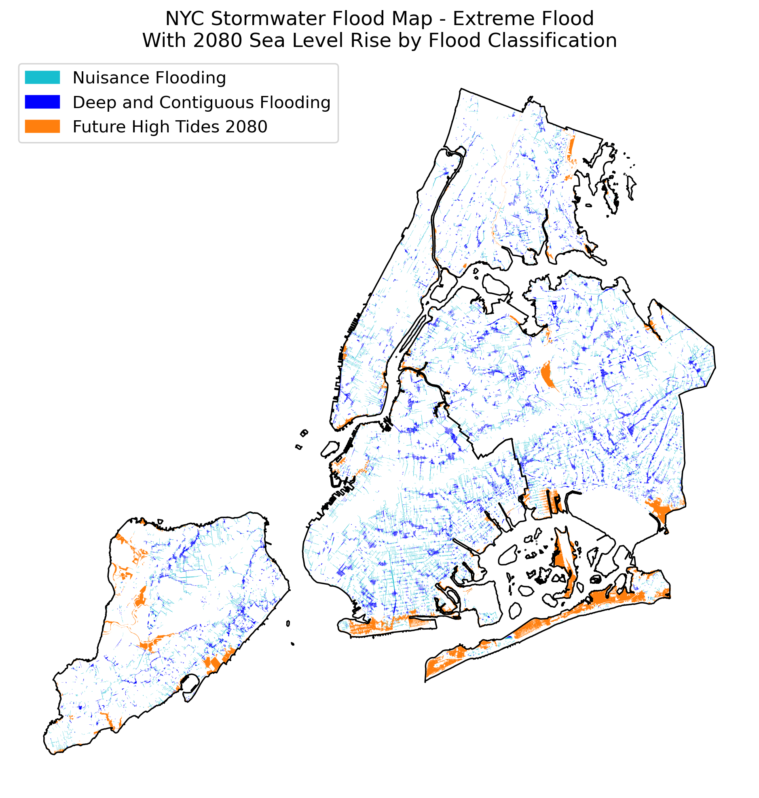

### Analyzing NYC's Stormwater Flood Map - Extreme Flood Scenario
Author: Mark Bauer

### Table of Contents
* [About the Project](#About-the-Project)
* [About the Data](#About-the-Data)
* [Say Hello!](#Say-Hello)

### About the Project 
This project attempts to recreate maps, figures and statistics from the New York City Stormwater Resiliency Plan in Python. Additionally, the project focuses on open source and reproducible workflows. All work is provided in these notebooks.

You can find many of the final outputs (maps, figures, etc.) in the [analysis.ipynb](https://github.com/mebauer/nyc-stormwater-map-analysis/blob/main/analysis.ipynb) notebook. If you're interested in examining all the steps to create this project, please see the other notebooks located in this repository.

### About the Data

Data Source:  
[NYC Stormwater Flood Map - Extreme Flood](https://data.cityofnewyork.us/City-Government/NYC-Stormwater-Flood-Map-Extreme-Flood/w8eg-8ha6) is freely available on NYC Open Data. 

The Report:  
You can read the official report published by the City titled [New York City Stormwater Resiliency Plan](https://www1.nyc.gov/assets/orr/pdf/publications/stormwater-resiliency-plan.pdf).

NYC Stormwater Flood Map Viewer:  
You can view these maps in an interactive dashboard at [NYC Stormwater Flood Map Viewer](https://experience.arcgis.com/experience/6f4cc60710dc433585790cd2b4b5dd0e).

### Say Hello!
Contact information:  
Twitter: [markbauerwater](https://twitter.com/markbauerwater)  
LinkedIn: [markebauer](https://www.linkedin.com/in/markebauer/)  
GitHub: [mebauer](https://github.com/mebauer)

Keywords: *New York City, NYC, NYC Water, Stormwater, Stormwater Management, Precipitation, Rainfall, Resiliency, Climate Resiliency, Climate Change, Plan, Map, DEP, Department of Environmental Protection, Flood, Flooding, Urban Flooding, Flood Zone, Flood Map, Sea Level Rise, Rain Garden, Data Analysis, Python, pandas, GeoPandas, GIS, Geographic Information System, Open Source*